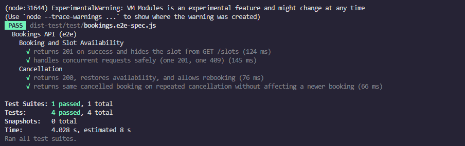

# appointment-booking

## Getting Started

### Prerequisites
- Docker and Docker Compose
- Node.js (for local development)

### Environment Variables
Copy the example environment file:
```bash
cp .env.example .env
```

### Running the Application
Start the services using Docker Compose:
```bash
docker-compose up -d --build
```

The services will be available at:
- **Backend (NestJS API)**: http://localhost:3000
- **Swagger UI**: http://localhost:3000/docs
- **OpenAPI JSON spec**: http://localhost:3000/openapi.json
- **Database (PostgreSQL)**: localhost:5432

### Features
- **Backend:** TypeScript, NestJS, Prisma, Socket.IO, and Swagger
- **Database:** PostgreSQL with a persistent volume and health check

---

## REST API Endpoints

Full documentation, including schemas, examples, and error codes, is available via the Swagger UI at `http://localhost:3000/docs`.

### 1. `GET /slots`
- **Description:** Returns all slots that do not have an active booking.
- **Sorting:** Sorted by `startsAt` ascending, then `id` ascending.
- **Response:** `200 OK` with `{ "slots": [...] }`.

### 2. `POST /bookings`
- **Description:** Creates a new booking for a slot.
- **Payload:** `{ "slotId": "uuid", "customerName": "Alice", "customerEmail": "alice@example.com" }`
- **Responses:**
  - `201 Created`: Booking successful.
  - `400 Bad Request`: Validation failed (e.g., missing name, invalid email).
  - `404 Not Found`: Slot does not exist.
  - `409 Conflict`: Slot already has an active booking.

### 3. `DELETE /bookings/:bookingId`
- **Description:** Cancels an active booking and restores slot availability. Safe to call repeatedly (idempotent).
- **Responses:**
  - `200 OK`: Returns the cancelled booking.
  - `404 Not Found`: Booking does not exist.

---

## Socket.IO Events

The server broadcasts real-time events on the default namespace (`/`) at path `/socket.io`.

| Event | Payload | Fired when |
|---|---|---|
| `slot.booked` | `{ slotId, bookingId, available: false }` | A booking is successfully created |
| `slot.released` | `{ slotId, bookingId, available: true }` | An active booking is cancelled |

Events are emitted **once per actual database change** — never for failed requests or repeated cancellations.

### Testing events without a frontend

**1. Install the client dependency (once):**
```bash
cd backend
npm install socket.io-client
```

**2. In one terminal — start the listener:**
```bash
node scripts/listen-events.mjs
# ✅ Connected  id=abc123  →  http://localhost:3000
# Listening for slot.booked and slot.released …
```

**3. In another terminal — trigger events via curl:**

```bash
# Get an available slot id
SLOT_ID=$(curl -s http://localhost:3000/slots | node -e "process.stdin.resume();let d='';process.stdin.on('data',c=>d+=c);process.stdin.on('end',()=>console.log(JSON.parse(d).slots[0].id))")

# Book it  →  emits slot.booked
curl -s -X POST http://localhost:3000/bookings \
  -H "Content-Type: application/json" \
  -d "{\"slotId\":\"$SLOT_ID\",\"customerName\":\"Alice\",\"customerEmail\":\"alice@example.com\"}" | jq .

# Copy the booking id from the response, then cancel it  →  emits slot.released
BOOKING_ID=<paste-id-here>
curl -s -X DELETE http://localhost:3000/bookings/$BOOKING_ID | jq .
```

You should see the events printed in the listener terminal in real time.

---

## Integration Tests

The project includes integration tests using Jest and Supertest. The tests use a separate test database to avoid affecting development data.

### Running Tests

1. Start your local PostgreSQL server (it must be available at `localhost:5432`, e.g., via the provided `docker-compose`).
2. Run the end-to-end tests:
   ```bash
   cd backend
   npm run test:e2e
   ```

The test runner will automatically create/reset the `appointment_booking_test` database and apply the necessary schemas.

### Test Results Preview



---

## Project Overview

### Design Decisions
- **Framework & Architecture**: NestJS was chosen for its highly modular, scalable, and testable architecture. The controllers are kept thin, delegating all business logic to the services.
- **Concurrency & Data Integrity**: To strictly prevent double-booking at the database level regardless of application scaling, a partial unique index (`bookings_one_active_per_slot ON bookings(slot_id) WHERE status='active'`) was implemented directly via PostgreSQL. This completely mitigates race conditions that could occur if relying on a simple "check-then-insert" logic.
- **Testing Approach**: Tests were implemented directly against a live PostgreSQL test database without mocking Prisma. This ensures that database-level constraints (like the partial unique index protecting against concurrent requests) are actually validated during CI. Native `tsc` compilation is used for tests to seamlessly bypass Jest/ESM transpilation complexities.

### Actual Time Spent
Approximately 4 hours.

### Unfinished Work
- None. All functional requirements, edge cases, Docker deployment, and OpenAPI documentation endpoints have been fully implemented.

### AI Disclosure
This codebase was developed with the assistance of an AI coding assistant (Google Antigravity). The AI was utilized to scaffold the NestJS boilerplate, generate repetitive integration tests, write documentation, and configure the Docker/Jest testing environments. All generated code was thoroughly reviewed and tested.
